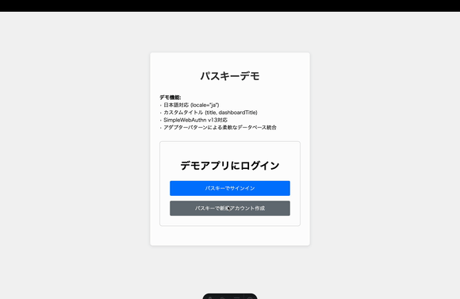

# Svelte Passkey Component

A reusable Svelte component library for passkey authentication, with framework-agnostic server-side helpers.



## 🚀 Features

- 🔐 **Passkey Authentication**: Modern, secure authentication using WebAuthn
- 🌍 **Internationalization**: Support for multiple languages including Japanese
- 🔧 **Framework Agnostic**: Server-side helpers work with any backend framework
- 🎨 **Customizable**: Flexible styling and configuration options
- 📦 **TypeScript**: Full TypeScript support with type definitions
- 🔄 **Adapter Pattern**: Flexible database and session storage integration

## 📦 Installation

```bash
npm install svelte-passkey-component @simplewebauthn/browser @simplewebauthn/server
```

## 🎬 Demo

The GIF above demonstrates the component in action:

- **Authentication Flow**: User registration and login with passkeys
- **Japanese Localization**: Full Japanese language support with custom titles
- **Responsive Design**: Works seamlessly across devices
- **Real-time Updates**: Dynamic UI state management

*Note: This is a demonstration of the component's capabilities. For a complete working example, see the demo app in the repository.*

## 💡 Usage

### Client-side (Svelte)

#### Basic Usage

```svelte
<script>
  import { PasskeyAuth } from 'svelte-passkey-component';
</script>

<!-- English (default) -->
<PasskeyAuth
  registerRequestUrl="/api/auth/register-request"
  registerResponseUrl="/api/auth/register-response"
  loginRequestUrl="/api/auth/login-request"
  loginResponseUrl="/api/auth/login-response"
  logoutUrl="/api/auth/logout"
  sessionUrl="/api/auth/session"
/>

<!-- Japanese -->
<PasskeyAuth
  locale="ja"
  registerRequestUrl="/api/auth/register-request"
  registerResponseUrl="/api/auth/register-response"
  loginRequestUrl="/api/auth/login-request"
  loginResponseUrl="/api/auth/login-response"
  logoutUrl="/api/auth/logout"
  sessionUrl="/api/auth/session"
/>

<!-- Custom titles -->
<PasskeyAuth
  locale="ja"
  title="マイアプリにログイン"
  dashboardTitle="マイアプリへようこそ"
  registerRequestUrl="/api/auth/register-request"
  registerResponseUrl="/api/auth/register-response"
  loginRequestUrl="/api/auth/login-request"
  loginResponseUrl="/api/auth/login-response"
  logoutUrl="/api/auth/logout"
  sessionUrl="/api/auth/session"
/>
```

#### Individual Components

```svelte
<script>
  import { AuthView, DashboardView } from 'svelte-passkey-component';
</script>

<!-- Auth View with Japanese -->
<AuthView
  locale="ja"
  registerRequestUrl="/api/auth/register-request"
  registerResponseUrl="/api/auth/register-response"
  loginRequestUrl="/api/auth/login-request"
  loginResponseUrl="/api/auth/login-response"
/>

<!-- Auth View with custom title -->
<AuthView
  locale="ja"
  title="セキュアログイン"
  registerRequestUrl="/api/auth/register-request"
  registerResponseUrl="/api/auth/register-response"
  loginRequestUrl="/api/auth/login-request"
  loginResponseUrl="/api/auth/login-response"
/>

<!-- Dashboard View with Japanese -->
<DashboardView
  locale="ja"
  logoutUrl="/api/auth/logout"
/>

<!-- Dashboard View with custom title -->
<DashboardView
  locale="ja"
  title="管理画面"
  logoutUrl="/api/auth/logout"
/>
```

#### Astro Integration

```astro
---
// src/pages/app.astro
import PasskeyAuth from 'svelte-passkey-component';
---

<html lang="en">
  <head>
    <meta charset="utf-8" />
    <meta name="viewport" content="width=device-width" />
    <title>Passkey App</title>
  </head>
  <body>
    <main>
      <h1>My Secure Application</h1>
      <PasskeyAuth
        client:load
        locale="ja"
        registerRequestUrl="/api/auth/register-request"
        registerResponseUrl="/api/auth/register-response"
        loginRequestUrl="/api/auth/login-request"
        loginResponseUrl="/api/auth/login-response"
        logoutUrl="/api/auth/logout"
        sessionUrl="/api/auth/session"
      />
    </main>
  </body>
</html>
```

### Server-side Implementation

The library provides framework-agnostic server-side helpers that work with any backend:

```typescript
import { 
  generateRegistrationOptions, 
  verifyRegistration,
  generateAuthenticationOptions,
  verifyAuthentication 
} from 'svelte-passkey-component/server';
import type { StorageAdapter, SessionAdapter } from 'svelte-passkey-component/server/adapters';

// Example with Express.js
app.post('/api/auth/register-request', async (req, res) => {
  const { options, user } = await generateRegistrationOptions({
    rpID: 'example.com',
    rpName: 'Example App',
    storageAdapter: yourStorageAdapter
  });
  
  res.json(options);
});

app.post('/api/auth/register-response', async (req, res) => {
  const verification = await verifyRegistration({
    response: req.body,
    expectedChallenge: challengeFromSession,
    expectedOrigin: 'https://example.com',
    rpID: 'example.com',
    storageAdapter: yourStorageAdapter,
    user: userFromSession
  });
  
  if (verification.verified) {
    res.json({ success: true, user: verification.user });
  } else {
    res.status(400).json({ success: false });
  }
});
```

## 🌍 Internationalization

### Supported Languages

Currently supported languages:

- **English** (`en`) - Default
- **Japanese** (`ja`) - 日本語

### Adding New Languages

You can extend the translations by adding new language support:

```typescript
import { translations } from 'svelte-passkey-component';

// Add French support
translations.fr = {
  auth: {
    title: 'Authentification par Passkey',
    signIn: 'Se connecter avec Passkey',
    createAccount: 'Créer un nouveau compte avec Passkey',
    processing: 'Traitement...',
    error: 'Erreur:'
  },
  dashboard: {
    welcome: 'Bienvenue !',
    loggedIn: 'Vous êtes connecté.',
    userHandle: 'Votre identifiant utilisateur:',
    logout: 'Déconnexion'
  }
};
```

### Auto-detection

```svelte
<script>
  import { browser } from '$app/environment';
  
  // Auto-detect browser language
  const locale = browser ? navigator.language.split('-')[0] : 'en';
</script>

<PasskeyAuth {locale} ... />
```

### Custom Titles

You can override the default titles while keeping the language support:

```svelte
<!-- Custom titles with Japanese locale -->
<PasskeyAuth
  locale="ja"
  title="アプリケーションログイン"
  dashboardTitle="ダッシュボード"
  // ... other props
/>

<!-- Individual components with custom titles -->
<AuthView
  locale="ja"
  title="セキュア認証"
  // ... other props
/>

<DashboardView
  locale="ja"
  title="ユーザー管理画面"
  // ... other props
/>
```

**Note**: When `title` or `dashboardTitle` is provided, it overrides the default translation for that specific text while keeping other translations intact.

## 🔧 Database Adapters

The library uses adapter patterns for database integration. You can implement your own adapters:

### Storage Adapter

```typescript
import type { StorageAdapter } from 'svelte-passkey-component/server/adapters';

// PostgreSQL with Prisma
export class PrismaStorageAdapter implements StorageAdapter {
  constructor(private prisma: PrismaClient) {}
  
  async getUser(userHandle: string) {
    return await this.prisma.user.findUnique({
      where: { id: userHandle },
      include: { authenticators: true }
    });
  }
  
  async createUser() {
    return await this.prisma.user.create({
      data: { id: randomUUID() },
      include: { authenticators: true }
    });
  }
  
  async getAuthenticator(credentialID: string) {
    return await this.prisma.authenticator.findUnique({
      where: { credentialID }
    });
  }
  
  async saveAuthenticator(authenticator: Authenticator) {
    await this.prisma.authenticator.create({
      data: authenticator
    });
  }
  
  async updateAuthenticatorCounter(credentialID: string, newCounter: number) {
    await this.prisma.authenticator.update({
      where: { credentialID },
      data: { counter: newCounter }
    });
  }
  
  async linkAuthenticatorToUser(userHandle: string, authenticator: Authenticator) {
    await this.prisma.authenticator.update({
      where: { credentialID: authenticator.credentialID },
      data: { userId: userHandle }
    });
  }
}
```

### Session Adapter

```typescript
import type { SessionAdapter } from 'svelte-passkey-component/server/adapters';

// Redis for sessions
export class RedisSessionAdapter implements SessionAdapter {
  constructor(private redis: Redis) {}
  
  async getSession(sessionId: string) {
    return await this.redis.get(`session:${sessionId}`);
  }
  
  async setSession(sessionId: string, userHandle: string) {
    await this.redis.setex(`session:${sessionId}`, 3600, userHandle); // 1 hour
  }
  
  async deleteSession(sessionId: string) {
    await this.redis.del(`session:${sessionId}`);
  }
}
```

## 📋 API Reference

### Props

| Prop | Type | Default | Description |
|------|------|---------|-------------|
| `locale` | `string` | `'en'` | Language code (e.g., 'en', 'ja') |
| `title` | `string` | - | Custom title for authentication view (overrides default translation) |
| `dashboardTitle` | `string` | - | Custom title for dashboard view (overrides default translation) |
| `registerRequestUrl` | `string` | - | URL for registration request endpoint |
| `registerResponseUrl` | `string` | - | URL for registration response endpoint |
| `loginRequestUrl` | `string` | - | URL for login request endpoint |
| `loginResponseUrl` | `string` | - | URL for login response endpoint |
| `logoutUrl` | `string` | - | URL for logout endpoint |
| `sessionUrl` | `string` | - | URL for session check endpoint |

### Events

The component emits standard Svelte events and uses stores for state management:

```typescript
import { authStore } from 'svelte-passkey-component';

// Subscribe to auth state changes
authStore.subscribe(state => {
  console.log('Auth state:', state);
  // { isLoggedIn: boolean, userHandle: string | null, error: string | null }
});
```

## 🛡️ Security Considerations

- **CORS**: Ensure your backend server has correct CORS headers configured
- **Session Management**: Implement robust server-side session management
- **Challenge Management**: Store challenge values securely to prevent replay attacks
- **Origin and RP ID**: Always verify expectedOrigin and expectedRPID
- **User Verification**: requireUserVerification: true ensures user verification

## 🤝 Contributing

Contributions are welcome! Please feel free to open issues or submit pull requests.

## 📄 License

MIT
